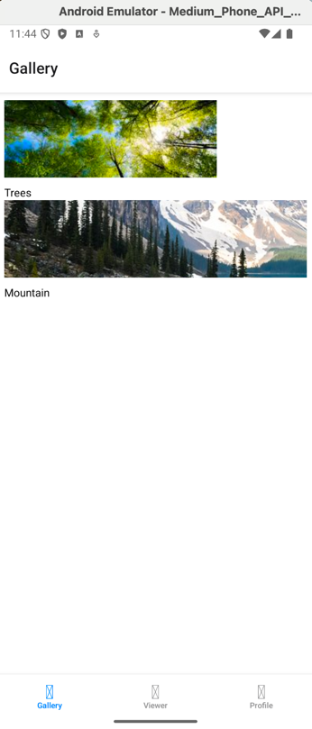
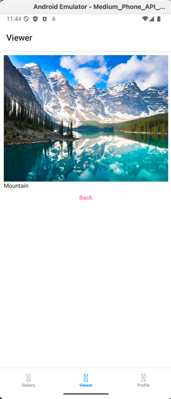
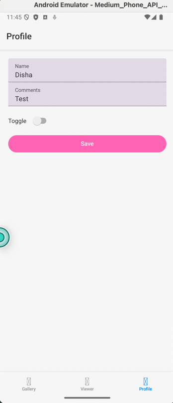

Disha Patel 
Info 670 
Assignment #3

A photo gallery App built using react native.

Features:
- navigation bar with 3 tabs 
  - gallery 
    - contains 2 pictures
    - 
  - viewer
    - open the selected picture
    - Back button to navigate back to the gallery 
    - 
  - profile 
    - name input field 
    - comments input field 
    - toggle button
    - save button 
    - 
- Pink and white theme 

Resources: 
reactnative.dev
errors and bugs in the code were fixed using chatgpt 
